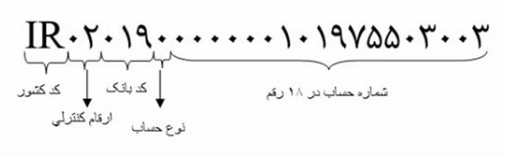

### امکانات کار با شماره شبا برای بانک های ایران

<br >

IBAN - شماره شبا

BBAN - شماره حساب

<br >



#### How to Download
```js
npm i ir-iban
```

#### How to import
```js
const { isIbanValid, turnBbanIntoIban, BANK_CODES, formatIban } = require('ir-iban')
```

or

```js
import { isIbanValid, turnBbanIntoIban, BANK_CODES, formatIban } from "ir-iban"
```

#### How to use
<br >

#### isIbanValid
این تابع مشخص میکند که آیا شماره شبا معتبر است و یا خیر

example
```js
  const iban = "IR870570028180010653892101"
  const isValid = isIbanValid(iban)
```

#### turnBbanIntoIban
این تابع شماره حساب را به شماره شبا تبدیل میکند

bban: string

bankCode: string -- use enum `BANK_COES` for example `BANK_CODES.TEJARAT`

bbanCode = "0" -- `optional`

`0` یعنی حساب سپرده

`1` یعنی حساب تسهیلات

countryCode = "IR" -- `optional`

<br >

example
```js
const bban = "4695069893"
const iban = turnBbanIntoIban(bban, BANK_CODES.TEJARAT)
```

#### getBankNameFromIban
با توجه به شماره شبا نام فارسی بانک را بر می گرداند

<br >

example
```js
const farsiBankName = getBankNameFromIban(iban)
```

#### isBankCodeValid
این تابع مشخص میکند که آیا کد بانک معتبر است و یا خیر

you can get bank codes from enum `BANK_CODES`

example

```js
const isValid = isBankCodeValid(BANK_CODES.TEJARAT)
```

#### formatIban
شماره شبا را به فرم استاندارد در خروجی می دهد

```js
const formattedIban = formatIban(iban)
// output: IR87 0570 0281 8001 0653 8921 01 
```

<br >

MIT License

Copyright (c) [year] [fullname]

Permission is hereby granted, free of charge, to any person obtaining a copy
of this software and associated documentation files (the "Software"), to deal
in the Software without restriction, including without limitation the rights
to use, copy, modify, merge, publish, distribute, sublicense, and/or sell
copies of the Software, and to permit persons to whom the Software is
furnished to do so, subject to the following conditions:

The above copyright notice and this permission notice shall be included in all
copies or substantial portions of the Software.

THE SOFTWARE IS PROVIDED "AS IS", WITHOUT WARRANTY OF ANY KIND, EXPRESS OR
IMPLIED, INCLUDING BUT NOT LIMITED TO THE WARRANTIES OF MERCHANTABILITY,
FITNESS FOR A PARTICULAR PURPOSE AND NONINFRINGEMENT. IN NO EVENT SHALL THE
AUTHORS OR COPYRIGHT HOLDERS BE LIABLE FOR ANY CLAIM, DAMAGES OR OTHER
LIABILITY, WHETHER IN AN ACTION OF CONTRACT, TORT OR OTHERWISE, ARISING FROM,
OUT OF OR IN CONNECTION WITH THE SOFTWARE OR THE USE OR OTHER DEALINGS IN THE
SOFTWARE.